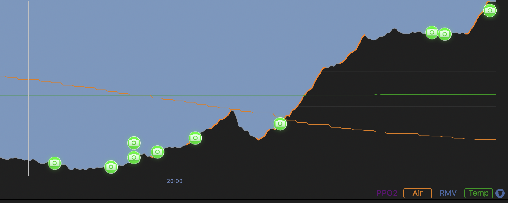

# GoPro Snapshot EXIF Data Corrector for MacDive

_Current version: *0.0.1*_

This script can be used to add EXIF data to images taken with the GoPro Quik snapshot tool that enables iamge marker compatibility with the MacDive 'dive profile' display as shown below.



## Prerequisites

When using the Docker image, there are no prerequisites other than Docker.
When running standalone, the running system needs to have `exiftool` installed.

## Usage

*Docker*
Running with Docker can be done by mounting the images to be processed into the `/data` directory within the container as follows:

```bash
docker run --rm -it -v"$(pwd):/data" danstreeter/exif-gopro-corrector:0.0.1
```

_The example above mounts the current working directory into the processing directory within the container._

*Standalone*
The script can be run 'as is' by providing the path to the image/directory you want to process as follow:

```bash
./script.js /path/to/images
```

_or_

```bash
./script.js /path/to/my/image.jpg
```
